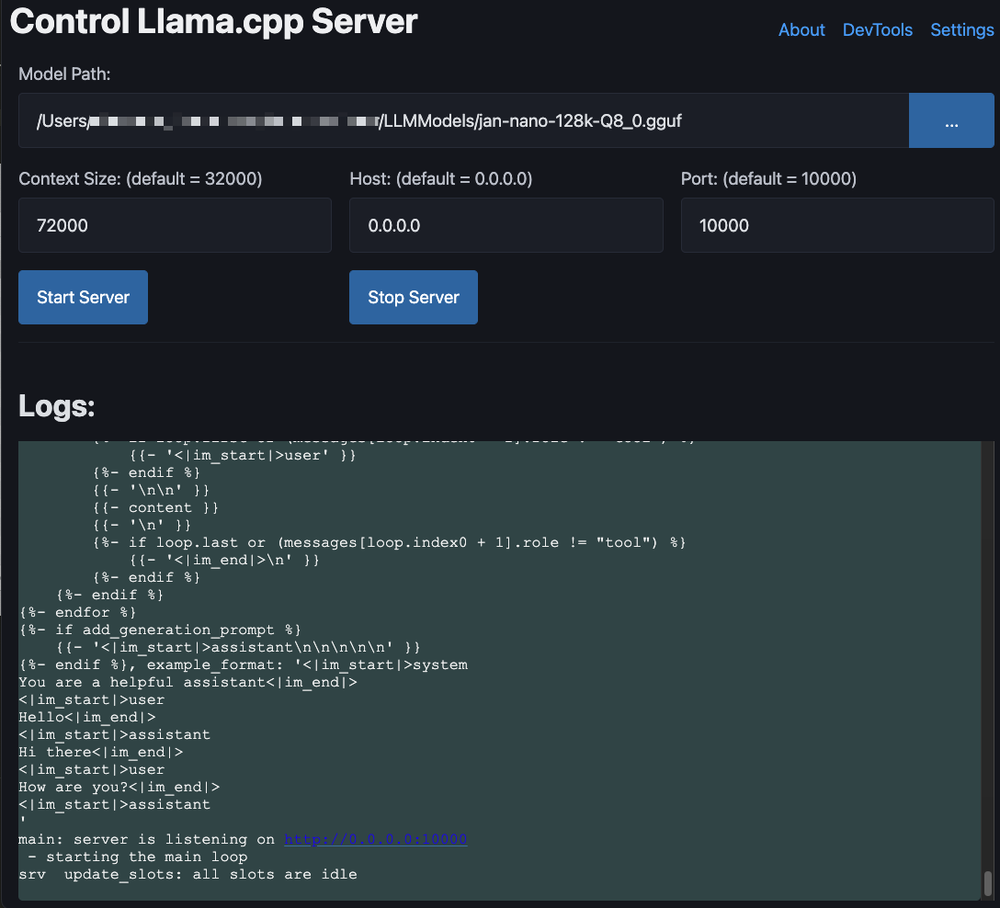
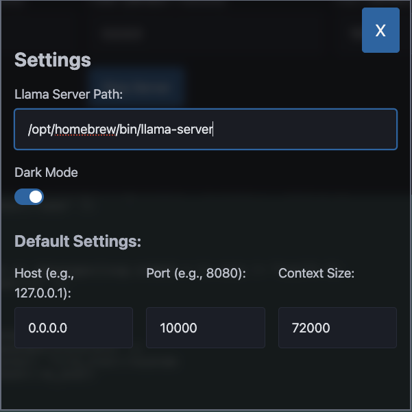

# llama.cpp Server GUI Wrapper

[](https://opensource.org/licenses/MIT)

[llama.cpp](https://github.com/ggml-org/llama.cpp) is an excellent way to enable LLM inference. This is a simple GUI wrapper around the llama.cpp server.


## History
It is a terminal / commandline program. It can be run as a server to be used with different OpenApi compatible client. I was having trouble remembering all the possible parameters to use when starting the server. So I created this simple wrapper around it.

## Screenshots





## Quick start

Getting started with this app is straightforward but you need make sure you have the pre-requisites installed. 

1. [Install llama.cpp](https://github.com/ggml-org/llama.cpp?tab=readme-ov-file#quick-start)
2. Download llama.cpp compatible LLM Model. You can do that from [huggingface.co](https://huggingface.co/models?apps=llama.cpp&sort=trending) website.
3. Create a folder on your machine and clone this repo
   ```
   git clone https://github.com/nitinkunte/llama-cpp-GUI.git
   ```
4. Run the app
   ```
   npm start
   ```
5. Alternatively, you can compile it into an app using 
   ```
   npx electron-packager . "Llama Server" --platform=darwin --arch=arm64 --out=./dist --icon="AppIcon.icns" --overwrite
   ```
   > Change `platform` directive to your OS. The one above is for MacOS. For linux it would be `--platform=linux`.

   > Change the `arch` depending on your architecture. 

